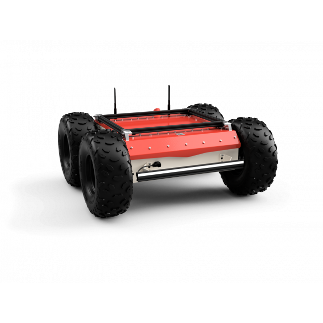

# Simulation Setup for test_custom_panther and camera_test_pkg

## Overview

This guide provides step-by-step instructions on setting up and running a simulation using the `test_custom_panther` and `camera_test_pkg` packages. Follow these steps to launch the Panther robot in a simulated environment and perform camera-based object detection and pose estimation.





## Step-by-Step Setup

### 1. Source the Husarion Workspace

First, source the `husarion_ws` workspace to make sure all necessary dependencies and environment variables are set up:

```bash
source ../husarion_ws/install/setup.bash
```

### 2. Build and Source the test_custom_panther Package

Next, build the `test_custom_panther` package and source it to prepare for the simulation:

```bash
cd ~/ros2_ws
colcon build --packages-select test_custom_panther
source install/setup.bash
```

### 3. Launch the test_custom_panther Simulation

Launch the main simulation file from the `test_custom_panther` package to start the Panther robot simulation:

```bash
ros2 launch test_custom_panther test_custom_panther.launch.py
```

### 4. Run the Sensor Fusion Node

Open a new terminal, source the `test_custom_panther` workspace again, and run the sensor fusion node from the `camera_test_pkg`:

```bash
source ~/ros2_ws/install/setup.bash
ros2 run camera_test_pkg sensor_fusion_covariance
```

### 5. Run the Map to Camera-Odom Transform Node

Open another terminal, source the workspace, and run the transform node:

```bash
source ~/ros2_ws/install/setup.bash
ros2 run camera_test_pkg map_cam_odom_tf
```

### 6. Launch the Camera Fusion

Open a fourth terminal, source the workspace, and launch the camera fusion setup:

```bash
source ~/ros2_ws/install/setup.bash
ros2 launch camera_test_pkg panther_fusion.launch.py
```

### 7. Visualize the Pose

Open a fifth terminal, and use the following command to visualize the robot's pose:

```bash
ros2 topic echo /robot_pose
```

### 8. Launch RViz for 3D Visualization

Finally, open another terminal and launch RViz to visualize the robot's pose in a 3D environment:

```bash
rviz2
```

## Notes

- Make sure each terminal session sources the setup script for the ROS 2 workspace to ensure all packages and environment variables are available.
- Ensure that RViz is configured to subscribe to the relevant topics and display the robot's pose correctly.

## Conclusion

Following these steps will set up the simulation environment for the Panther robot, enabling camera-based object detection, pose estimation, and visualization. This setup provides a comprehensive testing environment for developing and testing robot behavior in simulated scenarios.

---

## Summary

### 1. README.md for `test_custom_panther`

This file provides general information about the `test_custom_panther` package, including its features, prerequisites, installation instructions, usage guidelines, and additional nodes. Key features include:

- Multiple wheel configurations for versatile simulation scenarios.
- Integration with Ignition Gazebo for realistic simulations.
- Launch scripts for setting up and running simulations.

### 2. README.md for `camera_test_pkg`

This file focuses on the `camera_test_pkg` package, highlighting its capabilities for camera integration, object detection using the YOLO model, and pose plotting. Key features include:

- Support for multiple camera views (top-down and side).
- Dynamic switching between cameras based on object detection.
- Real-time visualization of detection results and robot poses.

### 3. New README for Simulation Setup

This newly created README provides a detailed, step-by-step guide to set up and run the simulation environment. It covers:

- Sourcing workspaces and building packages.
- Launching simulation and camera nodes.
- Visualizing robot pose and object detection using RViz and ROS topics.

These documents provide clear instructions and information for users to set up and utilize the `test_custom_panther` and `camera_test_pkg` packages in a ROS 2 environment.
```

### How to Use This Documentation

1. **Follow the Step-by-Step Setup**: Use the setup guide to correctly configure your simulation environment. Ensure each terminal session is sourced properly to access all packages and environment variables.
2. **Refer to the Updated README Files**: Each package (`test_custom_panther` and `camera_test_pkg`) has a dedicated `README.md` file with specific information on features, installation, and usage.
3. **Visualize Using RViz**: Make sure RViz is configured to subscribe to the appropriate topics to visualize the robot's pose and other relevant data.

This comprehensive documentation will help users understand how to set up and run simulations using the provided ROS 2 packages, ensuring a smooth and efficient development process.